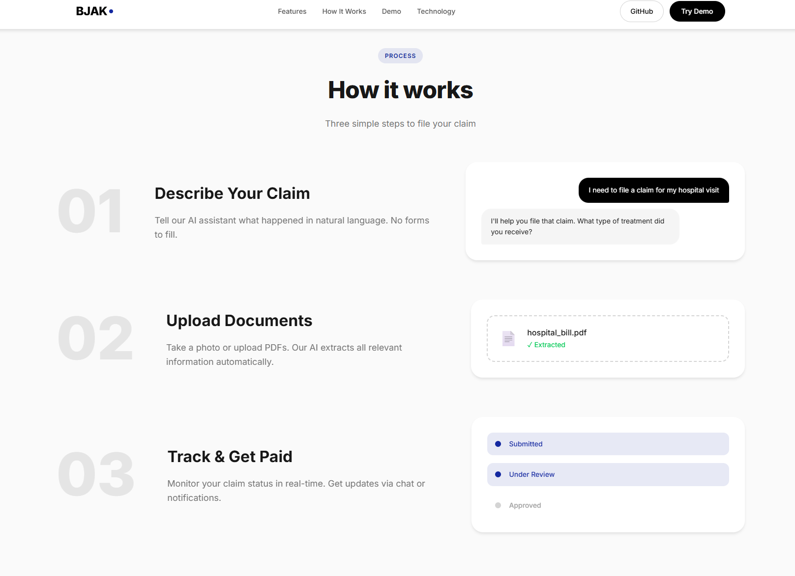

# BJAK AI Claims Assistant

<div align="center">


**AI-powered insurance claims processing assistant built for BJAK's Neobank platform**

[Live Demo](https://mysterious75.github.io/bjak-claims-assistant/) | [Report Bug](https://github.com/mysterious75/bjak-claims-assistant/issues) | [Request Feature](https://github.com/mysterious75/bjak-claims-assistant/issues)

</div>

---

## Screenshot

<div align="center">



*AI Claims Assistant - Interactive Demo Interface*

</div>

---

## Overview

An AI-native claims assistant that automates insurance claim intake, document processing, and FAQ responses using RAG (Retrieval-Augmented Generation) and LLM agents.

**Built for:** BJAK Applied AI Engineer Role  
**Status:** MVP Complete  
**Last Updated:** March 2024

---

## Features

| Feature | Description |
|---------|-------------|
| **AI Chat Assistant** | Natural language interaction for claims and FAQs |
| **Claim Filing** | Automated claim intake with validation |
| **Document Processing** | PDF/Image parsing with field extraction |
| **RAG-powered FAQ** | Accurate answers from insurance knowledge base |
| **Status Tracking** | Real-time claim status with timeline |
| **Human Escalation** | Automatic escalation when AI confidence is low |
| **Monitoring** | Interaction logging and performance metrics |

---

## Architecture

```
┌─────────────────────────────────────────────────────────────┐
│                    Streamlit UI                              │
│  (Chat, File Claim, Track, FAQ, Demo)                       │
└─────────────────────────────────────────────────────────────┘
                              │
                              ▼
┌─────────────────────────────────────────────────────────────┐
│                   Claims Agent                              │
│  - Process messages                                         │
│  - Decide actions (file, track, FAQ, escalate)              │
│  - Manage conversation state                                │
└─────────────────────────────────────────────────────────────┘
                              │
          ┌───────────────────┼───────────────────┐
          ▼                   ▼                   ▼
┌─────────────────┐ ┌─────────────────┐ ┌─────────────────┐
│   RAG Engine    │ │ Document Parser │ │   LLM Client    │
│   (ChromaDB)    │ │  (PDF/Image)    │ │   (Gemini)      │
└─────────────────┘ └─────────────────┘ └─────────────────┘
```

---

## Quick Start

### Prerequisites

- Python 3.9 or higher
- pip package manager
- Gemini API key ([Get one here](https://makersuite.google.com/app/apikey))

### Installation

```bash
# Clone the repository
git clone https://github.com/mysterious75/bjak-claims-assistant.git
cd bjak-claims-assistant

# Create virtual environment
python -m venv venv

# Activate virtual environment
# Windows:
venv\Scripts\activate
# macOS/Linux:
source venv/bin/activate

# Install dependencies
pip install -r requirements.txt

# Create .env file and add your API key
echo GEMINI_API_KEY=your_api_key_here > .env
```

### Run Locally

```bash
# Start the Streamlit app
streamlit run app.py

# The app will open at http://localhost:8501
```

---

## Project Structure

```
bjak-claims-assistant/
├── frontend/                 # Static website (GitHub Pages)
│   ├── index.html
│   ├── styles.css
│   └── script.js
├── backend/                  # Python backend
│   ├── __init__.py
│   ├── llm_client.py         # Gemini API client
│   ├── rag_engine.py         # RAG pipeline
│   ├── document_parser.py    # PDF/Image parsing
│   ├── claims_agent.py       # Claims workflow agent
│   └── evaluator.py          # Monitoring & evaluation
├── data/
│   └── faq/                  # Insurance FAQ documents
├── app.py                    # Streamlit UI
├── config.yaml               # Configuration
├── requirements.txt          # Dependencies
├── .env                      # API keys (gitignored)
├── .gitignore
└── README.md
```

---

## Configuration

Edit `config.yaml` to customize settings:

```yaml
llm:
  provider: "gemini"
  model: "gemini-2.5-flash"
  temperature: 0.3
  max_tokens: 2048

rag:
  embedding_model: "sentence-transformers/all-MiniLM-L6-v2"
  chunk_size: 500
  chunk_overlap: 50
  top_k: 5
  vectorstore_path: "./vectorstore"

claims:
  statuses:
    - "DRAFT"
    - "SUBMITTED"
    - "UNDER_REVIEW"
    - "APPROVED"
    - "REJECTED"
    - "PAID"
```

---

## Demo Scenarios

### Health Insurance Claim
```
User: "I need to file a health insurance claim"
Agent: Gathers information, validates, submits claim
User: "What documents do I need?"
Agent: RAG-powered answer with sources
```

### Motor Insurance Claim
```
User: "I was in a car accident"
Agent: Guides through claim process
User: "What's the status?"
Agent: Shows claim timeline
```

### Human Escalation
```
User: "I'm not happy with the decision"
Agent: Detects escalation intent
Agent: Escalates to human agent
```

---

## API Keys

### Getting a Gemini API Key

1. Go to [Google AI Studio](https://makersuite.google.com/app/apikey)
2. Sign in with your Google account
3. Click "Create API key"
4. Copy the key and add to `.env` file

### Environment Variables

```bash
# .env file
GEMINI_API_KEY=your_api_key_here
LLM_MODELS=gemini-2.5-flash,gemini-2.5-pro
```

---

## Technical Decisions

### Why RAG over Fine-tuning?

| Aspect | RAG | Fine-tuning |
|--------|-----|-------------|
| Cost | Low | High |
| Update Speed | Instant | Hours/Days |
| Transparency | Sources cited | Black box |
| Setup Time | Minutes | Hours |

### Why ChromaDB?

- **Local-first** - No external dependencies
- **Easy setup** - Works out of the box
- **Production-ready** - Can migrate to Pinecone for scale

### Why Gemini?

- **Free tier** - Cost-effective for demo
- **Fast** - Low latency responses
- **Vision support** - Can parse document images

---

## Monitoring

The app includes built-in monitoring:

- **Interaction logging** - All queries and responses logged to `logs/`
- **Response time tracking** - Performance metrics
- **Error detection** - Anomaly detection
- **Accuracy evaluation** - Test case validation

View metrics in the Streamlit sidebar or check the `logs/` directory.

---

## Future Improvements

- [ ] Production vector DB (Pinecone/Weaviate)
- [ ] Multi-language support (Vietnamese, Chinese)
- [ ] Real-time notifications (email/SMS)
- [ ] A/B testing framework
- [ ] Advanced analytics dashboard
- [ ] API endpoints for mobile integration
- [ ] Multi-modal document processing
- [ ] Authentication system
- [ ] Database persistence

---

## Role Alignment

This demo addresses key requirements from the BJAK Applied AI Engineer role:

| Requirement | Implementation |
|-------------|----------------|
| Build AI-powered workflows | Claims agent with tool calling |
| Apply AI across operations | Customer support, claims, FAQ |
| LLM APIs integration | Gemini API with fallback |
| RAG implementation | ChromaDB + LangChain |
| Evaluation & monitoring | Built-in evaluator module |
| Prototype quickly | Working MVP in 24 hours |
| Productionize | Clean architecture, ready to scale |

---

## License

MIT License - Built for BJAK Application

```
MIT License

Copyright (c) 2024 BJAK Claims Assistant

Permission is hereby granted, free of charge, to any person obtaining a copy
of this software and associated documentation files (the "Software"), to deal
in the Software without restriction, including without limitation the rights
to use, copy, modify, merge, publish, distribute, sublicense, and/or sell
copies of the Software, and to permit persons to whom the Software is
furnished to do so, subject to the following conditions:

The above copyright notice and this permission notice shall be included in all
copies or substantial portions of the Software.

THE SOFTWARE IS PROVIDED "AS IS", WITHOUT WARRANTY OF ANY KIND, EXPRESS OR
IMPLIED, INCLUDING BUT NOT LIMITED TO THE WARRANTIES OF MERCHANTABILITY,
FITNESS FOR A PARTICULAR PURPOSE AND NONINFRINGEMENT. IN NO EVENT SHALL THE
AUTHORS OR COPYRIGHT HOLDERS BE LIABLE FOR ANY CLAIM, DAMAGES OR OTHER
LIABILITY, WHETHER IN AN ACTION OF CONTRACT, TORT OR OTHERWISE, ARISING FROM,
OUT OF OR IN CONNECTION WITH THE SOFTWARE OR THE USE OR OTHER DEALINGS IN THE
SOFTWARE.
```

---

## Contact

**Project Link:** [https://github.com/mysterious75/bjak-claims-assistant](https://github.com/mysterious75/bjak-claims-assistant)

**Live Demo:** [https://mysterious75.github.io/bjak-claims-assistant/](https://mysterious75.github.io/bjak-claims-assistant/)

---

<div align="center">

Built with passion for BJAK's mission to democratize financial services

</div>
